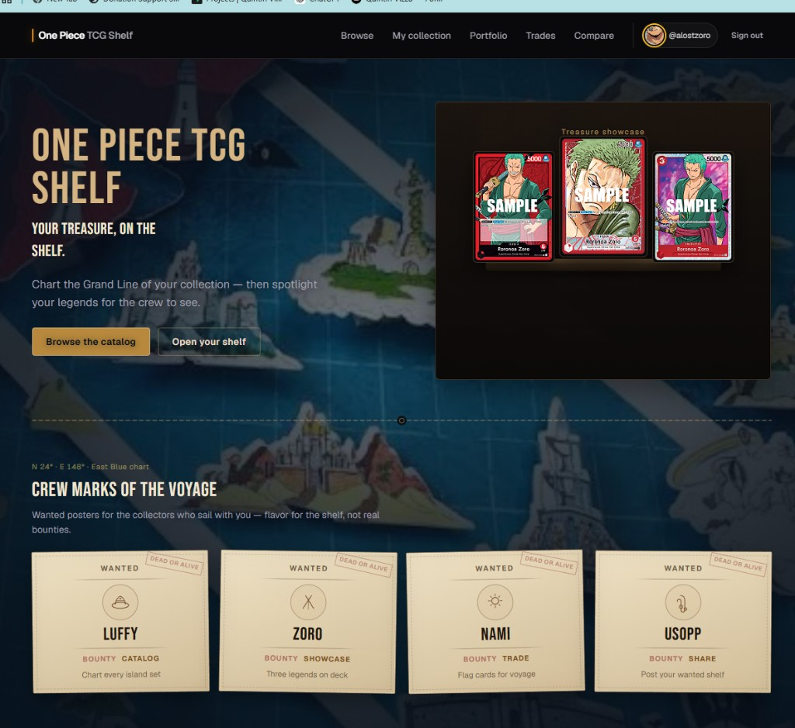
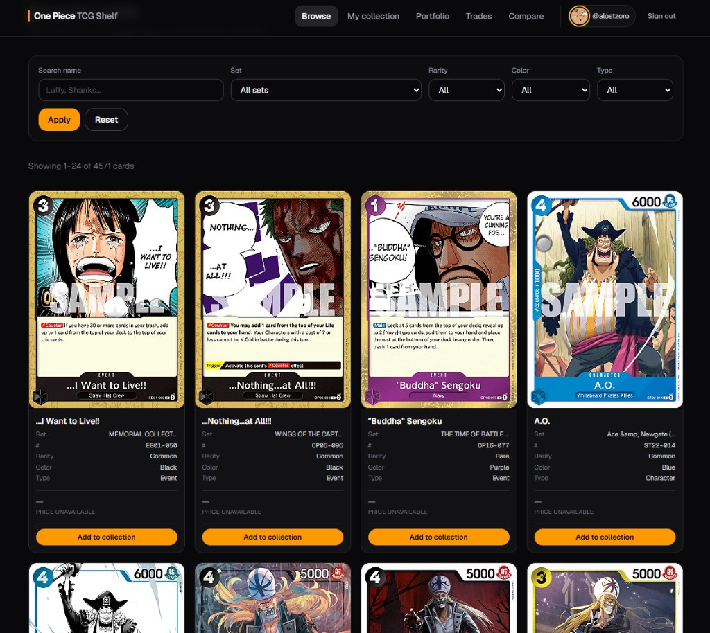
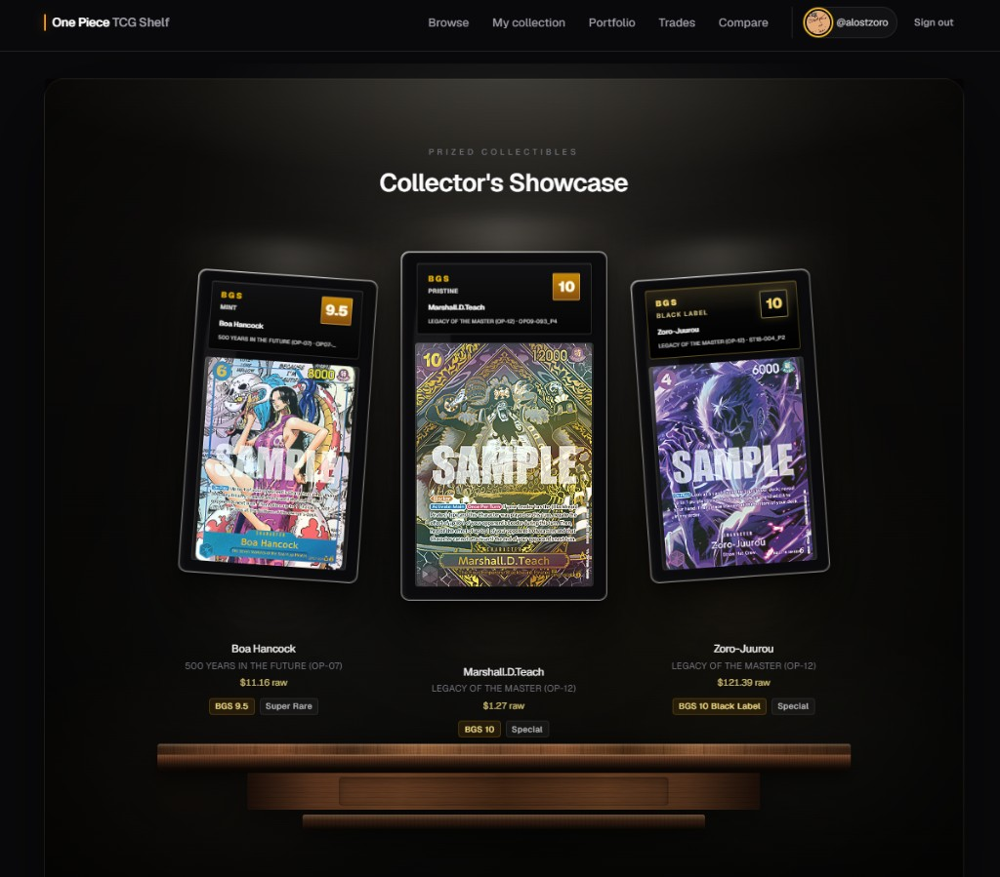

# One Piece TCG Shelf

A collector platform for the **One Piece Card Game**. Browse the catalog, track what you own (quantity, condition, grades, trades), pin a three-card **Collector’s Showcase**, and share a public profile at `/u/yourname`.

**Live demo:** [tcg-lyart.vercel.app](https://tcg-lyart.vercel.app/)

## Screenshots

### Home



### Browse



### Collector’s Showcase



## Features

- **Catalog browse** — search and filter; add cards to your collection
- **Collection dashboard** — quantities, conditions, graded slabs, trade flags, estimated values
- **Portfolio stats** — value from cached market prices × quantity (manual overrides win)
- **Live market prices** — server-side JustTCG sync into `card_prices` (no browser API calls)
- **Trade offers** — request / accept / decline on for-trade cards (inbox shows image, grade/condition, notes)
- **Activity feed** — public profile events (adds, trades, showcase updates)
- **Trade alerts** — watchlist when others list a card you want
- **Compare collectors** — overlap and unique cards between two usernames
- **Shelf match** — quick overlap snapshot when visiting someone else’s public shelf
- **Daily treasure** — one rotating shelf card spotlighted on each public profile per day
- **Wanted poster** — playful shelf bounty + rank on public profiles
- **Collector’s Showcase** — pin up to three prized cards or slabs on your public shelf
- **Public profiles** — shareable `/u/you` shelf with trade filter and view analytics
- **Social follows** — follow collectors, following activity feed, public follower/following counts
- **Suggested collectors** — people with shelf overlap you don’t follow yet (`/social`)
- **Public notes mode** — filter a shelf to cards with notes; multiline public note editor
- **Shelf deep links** — jump from alerts / activity / compare to `#card-…` on a public shelf
- **Public API** — JSON endpoints under `/api/v1` ([docs/API.md](./docs/API.md))
- **PWA** — installable web app
- **Account settings** — header account menu → customize profile (display name, bio, accent, avatar)
- **Auth** — email/password via Supabase

## Stack

- [Next.js](https://nextjs.org/) 16 (App Router) + React 19
- [Supabase](https://supabase.com/) (Postgres, Auth, Storage)
- [Tailwind CSS](https://tailwindcss.com/) 4 + Framer Motion

## Quick start

### 1. Install

```bash
npm install
```

### 2. Environment

Copy `.env.local.example` → `.env.local` and set:

| Variable | Purpose |
|----------|---------|
| `NEXT_PUBLIC_SUPABASE_URL` | Project URL |
| `NEXT_PUBLIC_SUPABASE_ANON_KEY` | Anon / public key |
| `SUPABASE_SERVICE_ROLE_KEY` | Server-only (avatar upload, catalog import, price sync) |
| `JUSTTCG_API_KEY` | Server-only JustTCG key for market prices ([docs](https://justtcg.com/docs)) |
| `PRICE_SYNC_SECRET` | Optional Bearer secret for `POST /api/admin/prices/refresh` (cron) |

**Local Supabase:** run `npm run setup` (PowerShell) to start Docker Supabase and write env values.

**Hosted Supabase:** Project Settings → API. Apply all SQL under `supabase/migrations/` (SQL editor or `npx supabase db push`). Do **not** skip `20250714000000_card_prices.sql` if you want variant-aware prices.

### 3. Catalog data

```bash
npm run import:catalog
```

Dry run / SQL / JSON variants: `import:catalog:dry`, `import:catalog:sql`, `import:catalog:json`.

### 4. Market prices (cache-first)

Pages never call JustTCG. Sync prices into Supabase with the CLI (service role + API key):

```bash
npm run prices:sync -- --limit 5
```

Useful flags: `--force`, `--set "Romance Dawn"`, `--card <uuid>`. Cron/ops can call `POST /api/admin/prices/refresh` with `Authorization: Bearer $PRICE_SYNC_SECRET`.

### 5. Dev server

```bash
npm run dev
```

Open [http://localhost:3000](http://localhost:3000).

## Scripts

| Command | Description |
|---------|-------------|
| `npm run dev` | Development server |
| `npm run build` | Production build |
| `npm run start` | Serve production build |
| `npm run lint` | ESLint |
| `npm test` | Vitest unit tests |
| `npm run setup` | Local Supabase + `.env.local` (Windows) |
| `npm run import:catalog` | Upsert card catalog into Supabase |
| `npm run prices:sync` | Refresh JustTCG prices into `card_prices` (quota-controlled) |
| `npm run supabase` | Supabase CLI passthrough |

## Deploy (Vercel)

1. Push to GitHub and import the repo in Vercel.
2. Set `NEXT_PUBLIC_SUPABASE_URL` and `NEXT_PUBLIC_SUPABASE_ANON_KEY` (and `SUPABASE_SERVICE_ROLE_KEY` for avatar uploads / price sync).
3. Set `JUSTTCG_API_KEY` and optionally `PRICE_SYNC_SECRET` for scheduled refresh.
4. In Supabase Auth → URL configuration, add your Vercel URL and `/auth/callback`.
5. Ensure migrations are applied on the hosted project.

## Project structure

See **[STRUCTURE.md](./STRUCTURE.md)** for a folder/file tree with explanations of every important path.

## Troubleshooting

**TLS / `UNABLE_TO_VERIFY_LEAF_SIGNATURE` (Windows antivirus):** Node may not trust a local intercepting CA. Dev, build, start, and price-sync scripts already pass `--use-system-ca`; auth uses the Next.js Proxy (Node runtime). Restart the dev server after pulling related changes.
